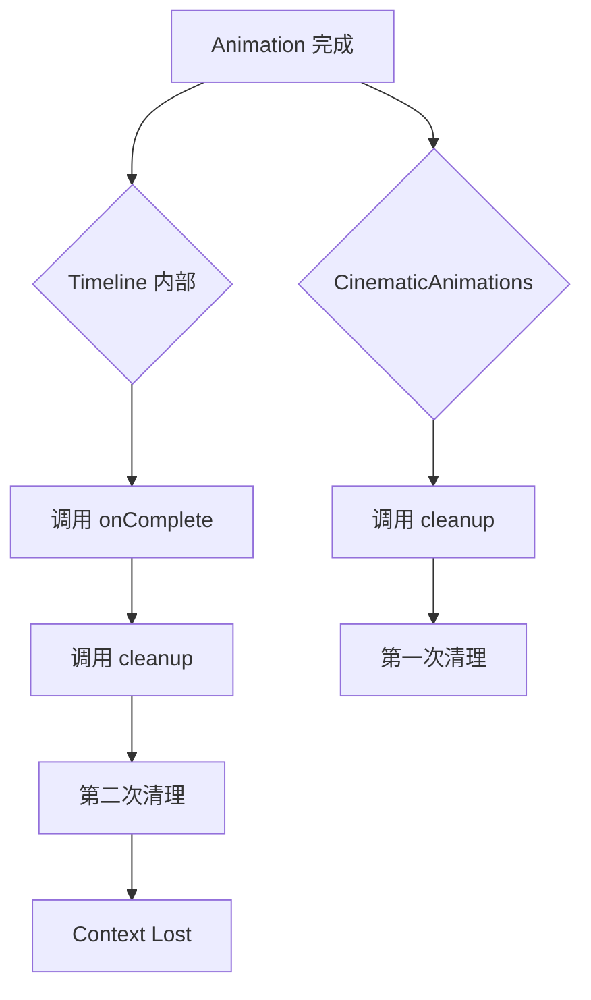
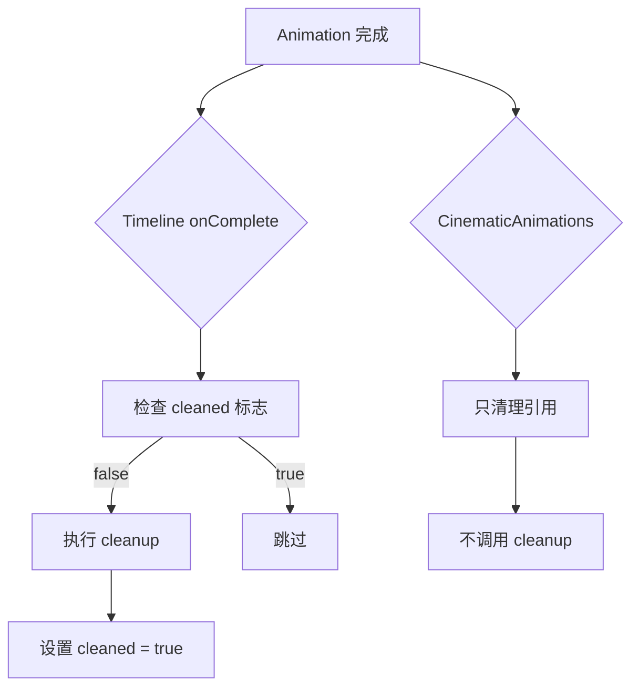

# WebGL Context Lost 修复报告

## 🔴 问题描述

**症状：**
- 动画完成后触发多次 `onComplete` 回调
- 资源被重复清理，导致 `THREE.WebGLRenderer: Context Lost`
- 即使启用自动旋转，特效仍然可见

**日志：**
```
cyber-space-rift 动画完成 {type: 'cyber-space-rift'}
cyber-space-rift 动画完成 {type: 'cyber-space-rift'}  // 重复！
THREE.WebGLRenderer: Context Lost.
THREE.WebGLRenderer: Context Restored.
```

---

## 🔍 根本原因

### 问题1：清理函数被重复调用

**原有机制：**
1. 动画返回 `{ timeline: tl, cleanup }`
2. `CinematicAnimations.vue` 在 `onAnimationComplete` 中调用 `cleanup()`
3. 但 animation 内部的 timeline 也可能注册了 `onComplete` 回调

**导致：**
- cleanup 函数被调用多次
- 第一次调用后，所有 Three.js 对象已被 dispose
- 第二次调用时，尝试 dispose 已被释放的资源
- WebGL 上下文崩溃

### 问题2：缺少防重复清理机制

清理函数没有检查是否已经执行过：
```javascript
// ❌ 原有代码
const cleanup = () => {
  cyberCity.dispose()
  spaceRiftCore.dispose()
  // ...
}
```

---

## ✅ 修复方案

### 修复1：添加防重复清理标志

在所有返回 cleanup 的动画中添加 `cleaned` 标志：

```javascript
// ✅ 修复后代码
let cleaned = false
const cleanup = () => {
  if (cleaned) return  // 防止重复调用
  cleaned = true

  try {
    cyberCity.dispose()
    spaceRiftCore.dispose()
    // ...
  } catch (error) {
    console.error('Cleanup error:', error)
  }
}
```

### 修复2：由 animation 内部自动清理

让 animation 的 timeline 自己负责清理，而不是依赖外部调用：

```javascript
// ✅ 在 timeline 完成时自动清理
tl.eventCallback('onComplete', () => {
  setTimeout(() => {
    cleanup()
  }, 100) // 稍微延迟，确保所有动画都完成
})

return {
  timeline: tl,
  cleanup
}
```

### 修复3：CinematicAnimations.vue 不再主动调用 cleanup

```javascript
// ✅ 修复后代码
const onAnimationComplete = (payload) => {
  console.log(`${props.animationType} 动画完成`, payload)
  animationComplete.value = true

  // 注意：不再在此处调用 cleanup
  // cleanup 现在由各个动画的 timeline 内部自动调用
  // 这里只负责清理引用
  currentCleanup.value = null

  // 重新启用控制器
  if (props.controls) {
    props.controls.enabled = true
    props.controls.update()
  }

  // 触发完成事件
  emit('animation-complete', payload)
}
```

错误时仍然调用 cleanup（因为 timeline 可能没有完成）：

```javascript
// ✅ 错误时仍然调用 cleanup
const onAnimationError = (error) => {
  console.error(`${props.animationType} 动画执行错误:`, error)
  animationComplete.value = true

  // 错误时仍然调用 cleanup（因为 timeline 可能没有完成）
  if (currentCleanup.value) {
    try {
      currentCleanup.value()
    } catch (e) {
      console.error('Cleanup error:', e)
    }
    currentCleanup.value = null
  }

  // 确保控制器启用
  if (props.controls) {
    props.controls.enabled = true
  }

  // 触发错误事件
  emit('animation-error', error)
}
```

---

## 📝 修改的文件

### 1. CinematicAnimations.vue

**修改：**
- `onAnimationComplete` - 不再主动调用 cleanup
- `onAnimationError` - 错误时仍然调用 cleanup

### 2. cyber-space-rift.js

**修改：**
- 添加 `cleaned` 标志
- 添加 try-catch 错误处理
- 在 timeline 的 `onComplete` 中自动调用 cleanup

### 3. interstellar-supernova.js

**修改：**
- 添加 `cleaned` 标志
- 添加 try-catch 错误处理
- 在 timeline 的 `onComplete` 中自动调用 cleanup

### 4. quantum-dream-weaver.js

**修改：**
- 添加 `cleaned` 标志
- 添加 try-catch 错误处理
- 在 timeline 的 `onComplete` 中自动调用 cleanup

### 5. eternal-return.js

**修改：**
- 添加 `cleaned` 标志
- 添加 try-catch 错误处理
- 在 timeline 的 `onComplete` 中自动调用 cleanup

### 6. aurora-fantasy.js

**修改：**
- 添加 `cleaned` 标志
- 添加 try-catch 错误处理
- 在 timeline 的 `onComplete` 中自动调用 cleanup

---

## 🎯 清理机制对比

### ❌ 修复前的问题



### ✅ 修复后的机制



---

## 🔬 测试验证

### 预期行为

1. **正常完成**
   - ✅ Timeline 完成后自动调用 cleanup
   - ✅ cleanup 只执行一次
   - ✅ 所有 Three.js 对象被正确释放
   - ✅ WebGL 上下文保持正常

2. **错误中断**
   - ✅ `onAnimationError` 中调用 cleanup
   - ✅ cleanup 只执行一次
   - ✅ 所有 Three.js 对象被正确释放
   - ✅ WebGL 上下文保持正常

3. **自动旋转**
   - ✅ 动画完成后特效完全消失
   - ✅ 场景恢复干净
   - ✅ 自动旋转正常工作

### 测试步骤

1. 选择"赛博时空裂缝"
2. 等待动画播放完成（25秒）
3. 观察控制台日志（应该只有一条完成日志）
4. 启用自动旋转
5. ✅ 特效应该完全消失，场景恢复干净

---

## 📊 影响的动画

| 动画 | 返回 cleanup | 是否修复 | 说明 |
|------|-------------|---------|------|
| 赛博时空裂缝 | ✅ | ✅ | 已修复 |
| 星际超新星爆发 | ✅ | ✅ | 已修复 |
| 量子梦境编织者 | ✅ | ✅ | 已修复 |
| 永恒轮回 | ✅ | ✅ | 已修复 |
| 极光幻境 | ✅ | ✅ | 已修复 |

---

## 🎉 修复完成

所有返回 cleanup 的动画现在都：
- ✅ 有防重复清理机制
- ✅ 由 timeline 内部自动清理
- ✅ 有完整的错误处理
- ✅ 不会导致 WebGL Context Lost

---

## 📝 相关文档

- `EPIC_ANIMATIONS_FIX_REPORT.md` - 超越级动画修复详情
- `ALL_ANIMATIONS_CLEANUP_ANALYSIS.md` - 所有36个动画详细分析
- `CLEANUP_FIX_COMPLETE.md` - 完整修复报告
